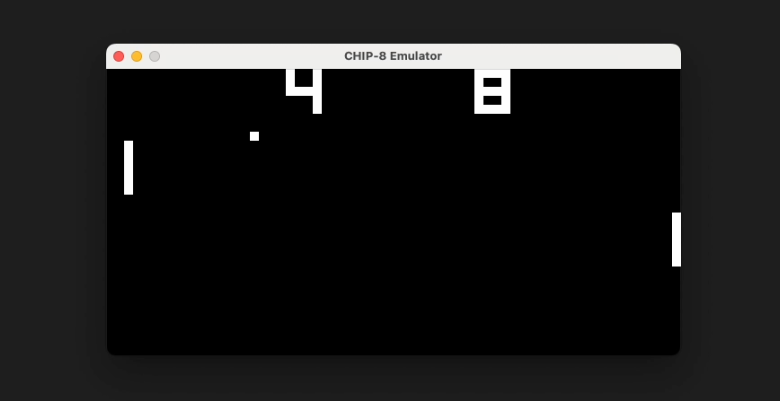

# tiger-chip-8
A Chip-8 emulator for playing retro games like PONG written with Rust


## Desktop
```
A CHIP-8 emulator written in Rust

Usage: tiger-chip-8 [OPTIONS] <ROM_FILE>

Arguments:
  <ROM_FILE>  

Options:
  -s, --scale <SCALE>                  [default: 15]
  -o, --ops-per-frame <OPS_PER_FRAME>  [default: 10]
  -h, --help                           Print help
  -V, --version                        Print version
```

## Prerequisites
You need to have SDL2 installed on your machine.

Instruction can be found in the [sdl2 github readme](https://github.com/Rust-SDL2/rust-sdl2).

### MacOS
```
brew install sdl2
export LIBRARY_PATH="$LIBRARY_PATH:$(brew --prefix)/lib"
```

## Running the Emulator

### Without Compiling an Executable
```
cargo run --release -- desktop/roms/PONG -s 10 -o 8
```

### With Compiling an Executable
```
cargo build --release
cp target/release/tiger-chip-8 .
./tiger-chip-8 desktop/roms/PONG
```
